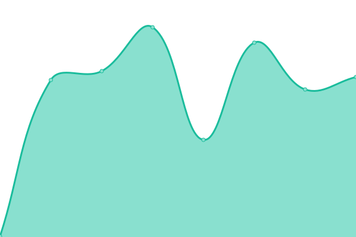
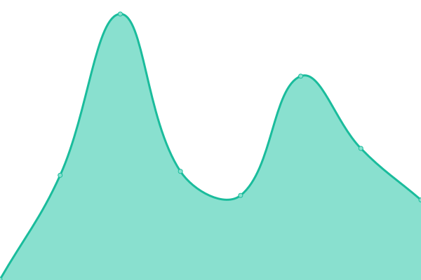
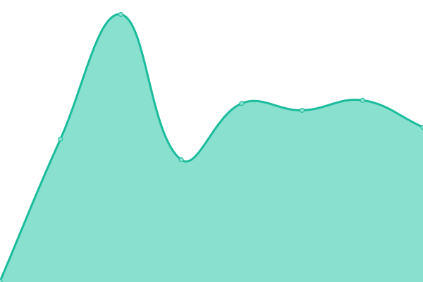

# [📈 Live Status](https://up.montalti.win): <!--live status--> **Tutti operativi**

This repository contains the open-source uptime monitor and status page for [1webdomain](https://up.montalti.win), powered by [Upptime](https://github.com/upptime/upptime).

With [Upptime](https://upptime.js.org), you can get your own unlimited and free uptime monitor and status page, powered entirely by a GitHub repository. We use [Issues](https://github.com/1webdomain/up/issues) as incident reports, [Actions](https://github.com/1webdomain/up/actions) as uptime monitors, and [Pages](https://up.montalti.win) for the status page.

<!--start: status pages-->
<!-- This summary is generated by Upptime (https://github.com/upptime/upptime) -->
<!-- Do not edit this manually, your changes will be overwritten -->
<!-- prettier-ignore -->
| URL | Status | History | Response Time | Uptime |
| --- | ------ | ------- | ------------- | ------ |
|  [montalti.it](https://www.montalti.it) | 🟩 Up | [montalti-it.yml](https://github.com/1webdomain/up/commits/HEAD/history/montalti-it.yml) | 

 928ms
     
 | 

<a href="https://up.montalti.win/history/montalti-it">100.00%</a>
    

|  [montalti.biz](https://www.montalti.biz) | 🟩 Up | [montalti-biz.yml](https://github.com/1webdomain/up/commits/HEAD/history/montalti-biz.yml) | 

 1783ms
     
 | 

<a href="https://up.montalti.win/history/montalti-biz">100.00%</a>
    

|  [montalti.org](https://www.montalti.org) | 🟩 Up | [montalti-org.yml](https://github.com/1webdomain/up/commits/HEAD/history/montalti-org.yml) | 

 284ms
     
 | 

<a href="https://up.montalti.win/history/montalti-org">100.00%</a>
    

|  [montalti.info](https://www.montalti.info) | 🟩 Up | [montalti-info.yml](https://github.com/1webdomain/up/commits/HEAD/history/montalti-info.yml) | 

 319ms
     
 | 

<a href="https://up.montalti.win/history/montalti-info">99.69%</a>
    

|  [montalti.net](https://www.montalti.net) | 🟩 Up | [montalti-net.yml](https://github.com/1webdomain/up/commits/HEAD/history/montalti-net.yml) | 

 314ms
     
 | 

<a href="https://up.montalti.win/history/montalti-net">100.00%</a>
    

|  [montalti.eu](https://www.montalti.eu) | 🟩 Up | [montalti-eu.yml](https://github.com/1webdomain/up/commits/HEAD/history/montalti-eu.yml) | 

 293ms
     
 | 

<a href="https://up.montalti.win/history/montalti-eu">100.00%</a>
    

<!--end: status pages-->

[**Visit our status website →**](https://up.montalti.win)

## 📄 License

- Powered by: [Upptime](https://github.com/upptime/upptime)
- Code: [MIT](./LICENSE) © [1webdomain](https://up.montalti.win)
- Data in the `./history` directory: [Open Database License](https://opendatacommons.org/licenses/odbl/1-0/)
